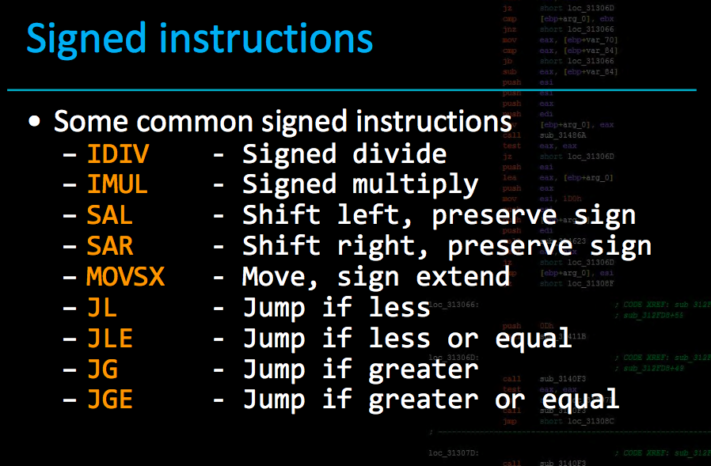
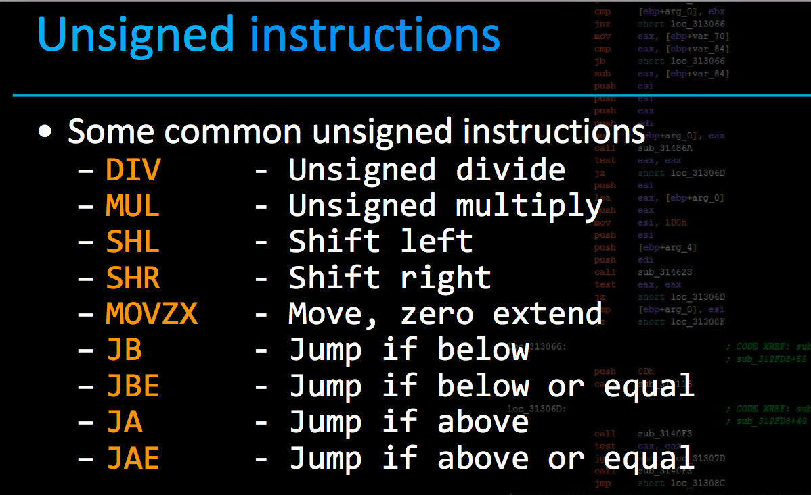

Binary Exploitation


# TOols

* nm : list all symbols(function/text sections etc)
* objdump
* gdb
* strace
* ltrace
* IDA/Ghidra


# Basics

endgoal :
* call system 
* call execve
* mprotect region rwx
* open/read/write flaag file
* get a reverse shell

> if binary is statically linked, look only for available options(like if execve even exist or not) otherwise for dynamic link bin. leak address and just use anything.

# OPEN, READ,Write

## 64 bit open,read write

```
64 bit calling read,write, open be like

def read(r, fd, buf, count):
    r.sendlineafter('RAX: ', '0')                <==== 0 syscall number is read
    r.sendlineafter('RDI: ', str(fd))            <==== fd is 1st arg
    r.sendlineafter('RSI: ', str(buf))           <==== buffer to read to is 2nd arg
    r.sendlineafter('RDX: ', str(count))         <==== how much to read(count) is 3rd arg

def write(r, fd, buf, count):
    r.sendlineafter('RAX: ', '1')                <==== 1 syscall number is write
    r.sendlineafter('RDI: ', str(fd))            <==== fd is 1st arg, that is the fd to write to
    r.sendlineafter('RSI: ', str(buf))           <==== buffer to write to is 2nd arg
    r.sendlineafter('RDX: ', str(count))         <==== how much to write(count) is 3rd arg

def open(r, pathname, flags):
    r.sendlineafter('RAX: ', '2')               <==== 2 syscall number is open file
    r.sendlineafter('RDI: ', str(pathname))     <==== filename to open
    r.sendlineafter('RSI: ', str(flags))        <==== extra flags like, open in read mode, write mode, append mode etc

```

This is registers to set to open, read or write to a file.


Open a file, 

## 32 bit open,read write
```
def openFile(filename):
    return '\n'.join([
        # getLittleEndian32(filename),
        pwnlib.shellcraft.i386.pushstr(filename),
        "mov ebx,esp",
        "xor ecx, ecx",
        "xor edx, edx",
        pwnlib.shellcraft.i386.linux.syscall('SYS_open'),
        ])


def readFile(count,fd="eax"):
    return '\n'.join([
        "sub esp, {}".format(count+5),
        "mov ebx, {}".format(fd),
        "mov ecx, esp",
        "mov edx, {}".format(count+5),
        pwnlib.shellcraft.i386.linux.syscall('SYS_read'),
        ])

def writeFile(count,pointerToString="esp"):
    return '\n'.join([
        "mov ecx,{}".format(pointerToString),
        shellcraft.i386.mov('edx', count).rstrip(),
        shellcraft.i386.mov('ebx', 1).rstrip(),
        shellcraft.i386.mov('eax', 4).rstrip(),
        "int 0x80"
        ])
```

## Alternatives to open read write

**openat, readv, and writev syscalls are the alternatives for open, read, and write syscalls, respectively, when the latter syscalls are blocked.**

# Signed/Unsigned

## Tracking Signedness

How does your program track signedness?

* Variable types are known at compile time, so signed instructions are compiled in to handle your variable. like using jbe(jump below equal) for unsigned comparison instead of (jle) for signed comparison.
    * what this means is when the program is compiled it will automatically use the assembly opcode jle when doing signed comparison, so its all known at compile time.

* Always check if `int` type is stored in `uint` or any mis-match

## Signed instructions



## Unsigned instructions




# Buffer Overflows

## x86/32 bit/i386/intel 80386
* FUZZING Can Just Find this

## x86_64/64 bit /amd64
* FUZZING Can Just Find this

# Stack Canaries attack

## Brute Forcing

* If canaries are 4-6 bytes long we can easily 1 by 1 brute force it

## Leak Canary with format strings

 * stack canary is the same for all function calls in the same thread. So a canary leak from one functions can be used anywhere in same thread.


# Format strings

# `__x86_get_pc_thunk_ax`

This call is used in position-independent code on x86. It loads the position of the code into the %ebx register, which allows global objects (which have a fixed offset from the code) to be accessed as an offset from that register.

Position-independent code is code that can be loaded and executed, unmodified, at different addresses. It is important for code that will be linked into shared libraries, because these can be mapped at a different address in different processes.

Note that an equivalent call is not required on x86-64, because that architecture has IP-relative addressing modes (that is, it can directly address memory locations as an offset from the location of the current instruction).


# File descriptor

As we know each open file gets file descriptor where :
* STDIN  = 0
* STDOUT = 1
* STDERR  = 2

So any file opened next will have file descriptor 3,4,5 - - -

# Strings class


## READ

> read(0,ADDR,128)
```
from file descriptor 0(stdin)  read in ADDR address 128bytes
```

### POSSIBLE ATTACKS :
* ADDRESS LEAK : 
 there is no null Byte that read appends in end , so if user sends 128 bytes input there will be no null byte in end , and printing output will print everything from start until it gets null byte so can cause ADDRESS LEAK 

* Read reads null bytes while GETS/STRCPY etc stop on \x00 

* considers the entered newline as a valid character just stops any furthur reeading

### PROTECTIONs :

* size is restricted 

E.g.

**memory layout**
```
0x7fffffffdd00: 0x4141414141414141      0x4141414141414141
0x7fffffffdd10: 0x4141414141414141      0x4141414141414141
0x7fffffffdd20: 0x4141414141414141      0x00007fffffffe1cd
```

* If there is a `printf` or `puts` used to output the buf, it will keep outputting until reaching NULL byte.
* In this case, we can get `'A'*40 + '\xcd\xe1\xff\xff\xff\x7f'`.

* `fread(buf, 1, 40, stdin)`
    * Almost the same as `read`, just that we can specify file descriptor.
    * **leakable**


## FGETS:

> fgets(readbuff, size, stdin)
```
read from stdin into readbuff the input size “size”
```

### POSSIBLE ATTACKS : 
* Its closing is when there is a  \x0a(newline) or if (n) bytes are exhausted .  good news is it does takes \x00 in string so we can pass strings with null bytes in them and it accept it.

### PROTECTIONs :
* auto append \x00 into the end of string input


## GETS:

> get(ADDR)
```
Read from stdin into Addr
```

### POSSIBLE ATTACKS

* No boundary check. Simply keep taking user input

## scanf

Assume that: `char buf[40]` and `signed int num`

### POSSIBLE ATTACKS

* `scanf("%s", buf)`
    * `%s` doesn't have boundary check.
    * **pwnable**

* `scanf("%40s", buf)`
    * At first sight, it seems reasonable.(seems)
    * It takes **40 bytes** from input, but it also **puts NULL byte at the end of input.**
    * Therefore, it has **one-byte-overflow**.
    * **pwnable**


### PROTECTIONs :

* `scanf("%39s", buf)`
    * `%39s` only takes 39 bytes from the input and puts NULL byte at the end of input.
    * **useless**


* `scanf("%d", &num)`
    * Used with `alloca(num)`
        * Since `alloca` allocates memory from the stack frame of the caller, there is an instruction `sub esp, eax` to achieve that.
        * If we make num negative, it will have overlapped stack frame.
        * E.g. [Seccon CTF quals 2016 cheer_msg](https://github.com/ctfs/write-ups-2016/tree/master/seccon-ctf-quals-2016/exploit/cheer-msg-100)
    * Use num to access some data structures
        * In most of the time, programs only check the higher bound and forget to make num unsigned.
        * Making num negative may let us overwrite some important data to control the world!


## STRCPY 

### POSSIBLE ATTACKS
Assume that there is another buffer: `char buf2[60]`

* `strcpy(buf, buf2)`
    * No boundary check.
    * It copies the content of buf2(until reaching NULL byte) which may be longer than `length(buf)` to buf.
    * Therefore, in case of overflow.
    * **pwnable**


## STRNCPY


### POSSIBLE ATTACKS
* `strncpy(buf, buf2, 40)` && `memcpy(buf, buf2, 40)`
* It copies 40 bytes from buf2 to buf, but it won't put NULL byte at the end.
* Since there is no NULL byte to terminate, it may have **information leak**.
* **leakable**


## strcat

Assume that there is another buffer: `char buf2[60]`

* `strcat(buf, buf2)`
    * Of course, it may cause **overflow** if `length(buf)` isn't large enough.
    * It puts NULL byte at the end, it may cause **one-byte-overflow**.
    * In some cases, we can use this NULL byte to change stack address or heap address.
    * **pwnable**

* `strncat(buf, buf2, n)`
    * Almost the same as `strcat`, but with size limitation.
    * **pwnable**
    * E.g. [Seccon CTF quals 2016 jmper](https://github.com/ctfs/write-ups-2016/tree/master/seccon-ctf-quals-2016/exploit/jmper-300)


## snprintf

### POSSIBLE ATTACKS

* `format strings`


# Heap Exploitation

```
So when there is call to sbrk=> it internally calles brk or mmap depending on size needed.
sbrk is wrapper to these syscalls.

so 


higher       --------------------
memory      |                   |
            |                   |
            |                   |
            |                   |
            |                   |
            |                   |
            |                   |
            |                   |
            |                   |
            |                   |
            |                   |
            |                   |
            |                   |
            |                   |
            |                   |
            |                   |
            |                   |
            |                   |
lower       |                   |
memory       --------------------


at first there is no heap, so everything is called arena. after call to sbrk


higher       --------------------
memory      |                   |
            |                   |
            |                   |
            |                   |
            |                   |
            |    Arena is left  |
            |    over space     |
            |  which can be used|  <============ Arena is left space, so if we need more then 
            | if more momeoy is |           1KB heap and our old heap is full we can ask for more
            |     needed        |           from arena
            |                   |
            |                   |
            |                   |
            |                   |
            --------------------
            |      memory       |
            |   alloceted by    |   <==========(Heap): this allocated area is caled heap.
            | sbrk(1 page table)|             we get 1 page table we can use to 
lower       |                   |           allocate our multiple malloced stuff
memory       --------------------


```


